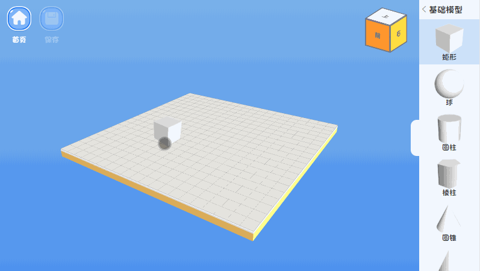

# 3D Printer Workspace (three.js)
========

[![NPM Package][npm]][npm-url]
[![Build Size][build-size]][build-size-url]
[![NPM Downloads][npm-downloads]][npmtrends-url]
[![Dev Dependencies][dev-dependencies]][dev-dependencies-url]
[![Language Grade][lgtm]][lgtm-url]

#### Project Description ####

This project is based on three.js to creat 3D models. Such as default modules (Cube,Ball,Cylinder,Prismatic,Cone,Doughnut,Hollowcylinder...), and also include the assets locally stls(Standing/climbing/lying/sitting person, personal using only pokemons)

### Usage ###

This code creates a scene, a camera, and you can drag and drop objects from the right side menu to the workspace and modify the size/position/rotation and so on. 
Through threejs creates a `WebGL` renderer for the scene and camera, and it adds that viewport to the `document.body` element. Finally, it animates the workspan within the scene for the camera.

This project used `DecalGeometry`, `OrbitControls`, `STLLoader`... (without ES6).
 
Download project and run `npm install`, then just find the file path: `../src/3DPrinting.html`

### Showcase: ### 

[npm]: https://img.shields.io/npm/v/three
[npm-url]: https://www.npmjs.com/package/three
[build-size]: https://badgen.net/bundlephobia/minzip/three
[build-size-url]: https://bundlephobia.com/result?p=three
[npm-downloads]: https://img.shields.io/npm/dw/three
[npmtrends-url]: https://www.npmtrends.com/three
[dev-dependencies]: https://img.shields.io/david/dev/mrdoob/three.js
[dev-dependencies-url]: https://david-dm.org/mrdoob/three.js#info=devDependencies
[lgtm]: https://img.shields.io/lgtm/alerts/github/mrdoob/three.js
[lgtm-url]: https://lgtm.com/projects/g/mrdoob/three.js/
